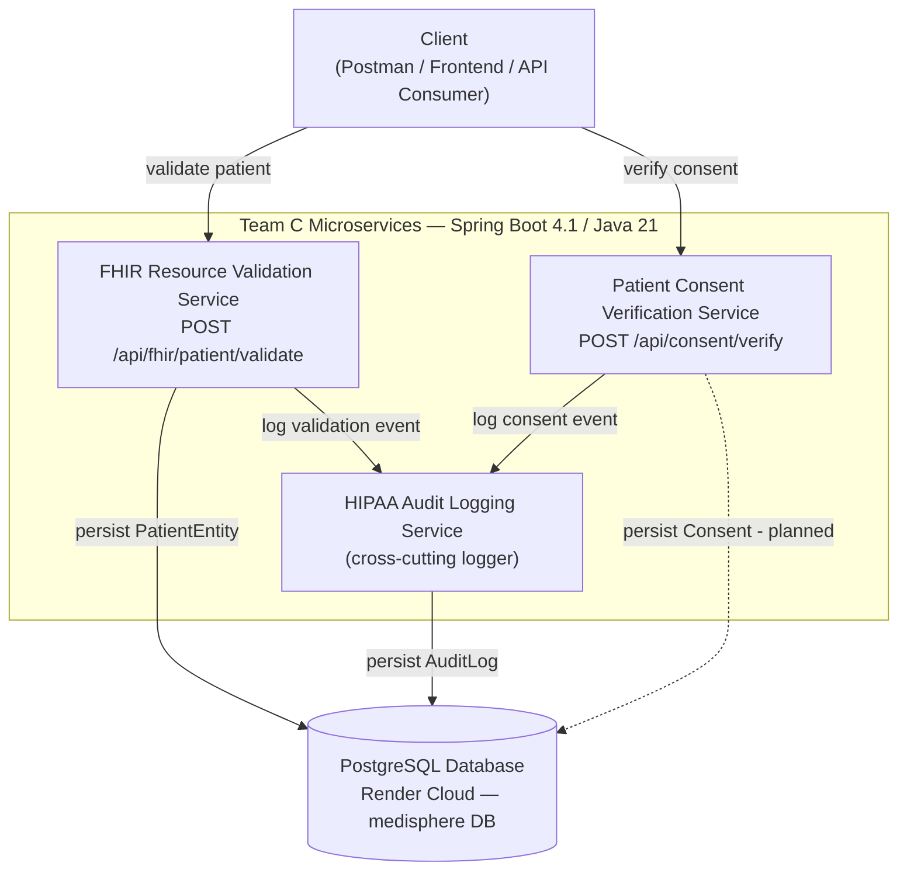
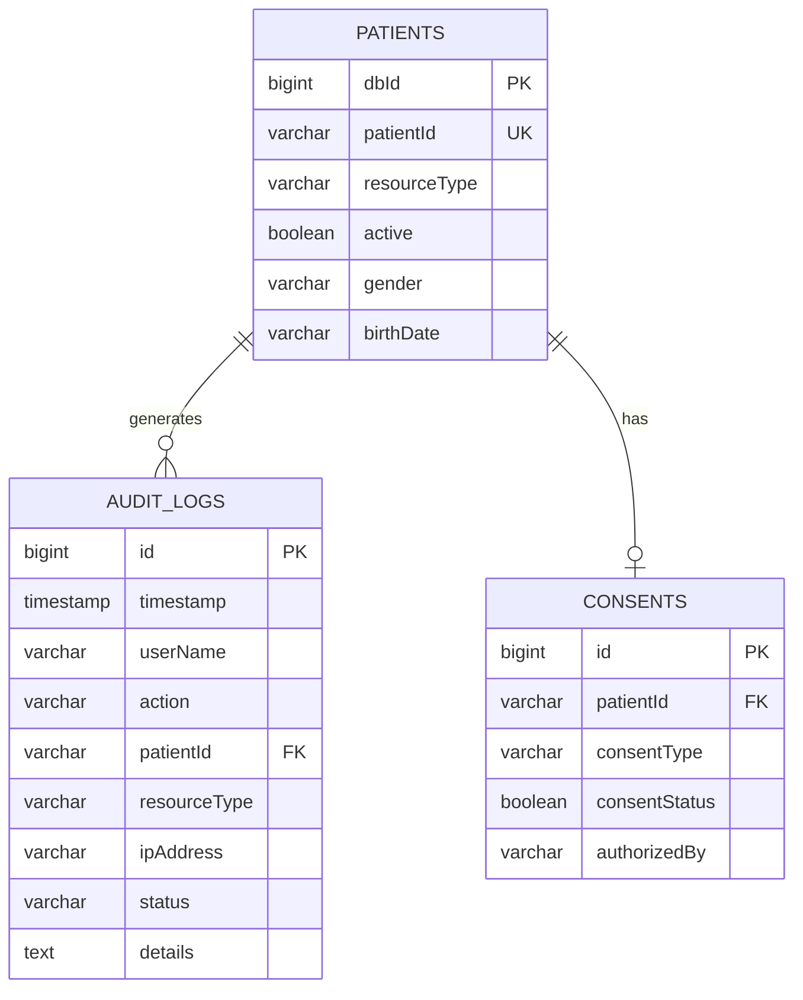

# MediSphere — Healthcare Management Platform

**Team C** · FHIR Resource Validation · Patient Consent Verification · HIPAA Audit Logging

Medisphere is a modular healthcare management platform built as a set of independent, loosely-coupled Spring Boot microservices. Each service owns one concern — validating FHIR patient data, verifying patient consent, or recording an auditable trail of those decisions — and all three share a single PostgreSQL database.

## Tech Stack

| Layer | Technology |
|---|---|
| Language / Runtime | Java 21 |
| Application Framework | Spring Boot 4.1.0 (`spring-boot-starter-parent`) |
| Web Layer | Spring MVC (`spring-boot-starter-web`) |
| Validation | Jakarta Bean Validation (`spring-boot-starter-validation`) |
| Persistence | Spring Data JPA, Hibernate ORM |
| Database | PostgreSQL 16, hosted on Render Cloud |
| Boilerplate reduction | Lombok |
| Build tool | Maven (`mvnw` wrapper) |

> **Note:** the project was originally scoped for Java 25 / Spring Boot 4.1. The services are pinned to **Java 21** here for build stability — Java 21 is a widely supported LTS release and avoids toolchain issues some contributors hit with `--release 25`.

## Architecture



Each service:
- Is independently runnable, with its own Maven project (`pom.xml`) and package namespace under `com.teamc`
- Communicates over plain REST/JSON
- Follows a layered architecture: **Controller → Service → (Validator) → Repository/Entity**
- Returns a consistent response envelope: `{ "status", "message", "errors" }`
- Handles exceptions centrally via `@ControllerAdvice` / `@RestControllerAdvice`

## Team Responsibilities

| # | Name | Role |
|---|---|---|
| 1 | Saranya | Backend |
| 2 | Raja Somesh | Backend |
| 3 | Shashikant | Backend |
| 4 | Nhowmitha | Documentation |
| 5 | Nilesh | Database |
| 6 | Pinki | Frontend |
| 7 | Karishma | Frontend |

Work was intentionally sequenced so each module could be validated standalone before the shared database layer was wired in — the FHIR validation logic, for example, was built and confirmed working before persistence (Entity/Repository/Service/DB config) was layered on top of it.

---

## Services

### 1. FHIR Resource Validation

Validates an incoming FHIR-style `Patient` resource before it's trusted or persisted anywhere else, then persists it to the shared `patients` table once validation succeeds.

**Endpoint:** `POST /api/fhir/patient/validate`

Request:
```json
{
  "resourceType": "Patient",
  "id": "P101",
  "active": true,
  "gender": "male",
  "birthDate": "2002-08-10"
}
```

Success (`200 OK`):
```json
{ "status": "SUCCESS", "message": "FHIR Patient Resource is valid", "errors": [] }
```

Failure (`400 Bad Request`):
```json
{ "status": "FAILED", "message": "Validation Failed", "errors": ["Patient ID is required"] }
```

**Validation rules**

| Field | Rule |
|---|---|
| `resourceType` | Required; must equal `"Patient"` (case-insensitive) |
| `id` | Required, non-blank |
| `active` | Required (not null) |
| `gender` | Required; one of `male`, `female`, `other`, `unknown` |
| `birthDate` | Required; `yyyy-MM-dd`; cannot be a future date |

All failing rules are collected — the API never stops at the first error.

### 2. Patient Consent Verification

Confirms a patient has given explicit, approved consent for a specific clinical action before that action proceeds.

**Endpoint:** `POST /api/consent/verify`

Request:
```json
{
  "patientId": "P12345",
  "consentType": "TREATMENT",
  "consentStatus": true,
  "authorizedBy": "Dr. Meera Nair"
}
```

Success (`200 OK`):
```json
{ "status": "SUCCESS", "message": "Patient consent verified successfully.", "errors": [] }
```

**Validation rules**

| Field | Rule |
|---|---|
| `patientId` | Required, non-blank |
| `consentType` | Required; one of `SURGERY`, `TREATMENT`, `DATA_SHARING`, `EMERGENCY` |
| `consentStatus` | Required (not null); must be `true` to succeed |
| `authorizedBy` | Required, non-blank |

### 3. HIPAA Audit Logging

Records a tamper-evident trail of consent-verification and validation decisions, satisfying HIPAA's audit-control requirement (45 CFR §164.312(b)). Invoked as a cross-cutting logger from the other two services after each request completes.

**Recorded fields:** `id`, `timestamp`, `userName`, `action`, `patientId`, `resourceType`, `ipAddress`, `status` (`SUCCESS`/`FAILURE`), `details` (populated on failure only).

---

## Database Design

All modules share a single PostgreSQL 16 database (`medisphere`) hosted on Render Cloud. `hibernate.ddl-auto=update` keeps the schema in sync with entity classes during development.



| Table | Status |
|---|---|
| `patients` | Implemented |
| `audit_logs` | Implemented |
| `consents` | Planned — consent verification is currently stateless |

---

## Getting Started

### Prerequisites
- Java 21 JDK
- Maven (or the bundled `mvnw` wrapper)
- Network access to the Render-hosted PostgreSQL instance (SSL required)

### Run the services

Start in this order — the audit service is a dependency of the other two, and consent verification depends on a patient already existing (created via FHIR validation):

```bash
# 1. Audit service
cd audit-service
./mvnw spring-boot:run          # -> http://localhost:8082

# 2. FHIR validation
cd fhir-validation
./mvnw spring-boot:run          # -> http://localhost:8080

# 3. Patient consent verification
cd patient-consent-verification-main
./mvnw spring-boot:run          # -> http://localhost:8081
```

### Run the frontend

```bash
cd frontend
python3 -m http.server 5500     # -> http://localhost:5500
```

### Configuration

Datasource credentials are read from `application.properties` via environment-variable overrides, falling back to the shared Render instance if unset:

```properties
spring.datasource.url=${DB_URL:jdbc:postgresql://<render-host>:5432/medisphere?sslmode=require}
spring.datasource.username=${DB_USERNAME:<default>}
spring.datasource.password=${DB_PASSWORD:<default>}
```

Set `DB_URL`, `DB_USERNAME`, and `DB_PASSWORD` in your environment to point at a different database without touching source-controlled files.

### Verifying a deployment
- `POST /api/fhir/patient/validate` with the sample request above → expect `200`
- `POST /api/consent/verify` with the sample request above → expect `200`
- Check `audit-service` logs / `GET /api/audit/logs` for a corresponding entry
- Query the `patients` table to confirm a row was inserted after a successful validation call

---

## Future Enhancements

- Extend the HIPAA audit logger to cover the FHIR validation endpoint, not just consent verification
- Add persistence (`Entity`/`Repository`) for consent records, replacing the current stateless flow
- Move shared datasource credentials fully into a secrets manager
- Introduce an API gateway for unified auth, rate limiting, and routing across all three services
- Expand FHIR validation beyond the `Patient` resource type
- Add automated integration tests (e.g. Testcontainers + PostgreSQL)
- Publish a shared OpenAPI/Swagger spec across all three services
